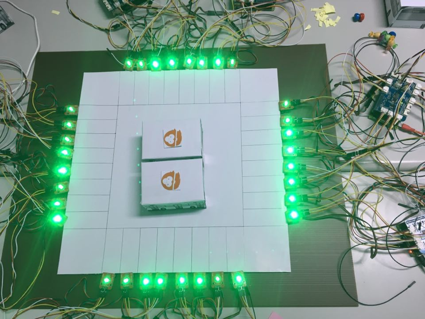

# (Final) Distributed, Dynamic Parking systems
> Department of Computer Science and Information Engineering, National Taiwan University (NTUCSIE) \
> [Design for IoT Middleware (2017, Fall)](https://ceiba.ntu.edu.tw/course/3e1205/index.htm) - Final Project

## Collaborators :
NTU-CSIE 顏逸東(Yan.YiDong) \
NTU-CSIE 謝崴宇(Hseih.WeiYu) \
NTU-EECS 吳明憲(Ｗu.MingSian) ([github](https://github.com/spadek67424))

## System Introduction :

### Abstract :
Distributed, dynamic parking system aims to provide more parking spaces. The system work in raspberryPi or other tiny computer, and the computer will be installed at every parking lot. To guide the user to the vacant space we predicted, the system will calculate score for every parking space, and set the price according to the score. We assume user will choose the space with lowest price, and we can make parking lot easier to split and merge spaces we want, then make biggest profit to system and public.

### communication and sensors : 

Communication between computers is implemented with [MQTT](https://swf.com.tw/?p=1002), and parking event is triggered by **magnetic sensors**. For demo, every parking space show whether vacant or not with **LED sensor**, which green light represent vacant and red one represent parked.

### Algorithm :
In every parking lot, we assume there's 8 parking space in a parking lot, and **all parking spaces are in one side** (That is, for every 4 consistent and vacant scooter parking space, we can merge them to a car parking space). \
First, our algorithm will calculate a score for each parking space. The algorithm is simple :
	
	score = SnE + SnV + VnE

- _S_ means **Space**, _E_ means **Edge** (each parking lot have 2 edge, left and right one) and _V_ means **vehicle which is parking on nearby space**. 
- _SnE_ represent **the distance from the space to nearest edge** . Choose left one if parking lot have odd number spaces and the space we choosing is in the middle.
- _SnV_ represent **the distance from the space to nearest parking vehicle**. Choose the one which have same nearest edge with the space if there have nearest parking vehicles on both side. Also, choose left one if parking lot have odd number parking space and the space is in the middle.
- _VnE_ represent **the distance from nearest vehicle to its nearest edge**. the nearest vehicle is one we chose in _SnV_.

After we get every score from vacant spaces, we choose the space with lowest score (as the highest priority) and set it price as $10, and other space will be set as $20. While there are multi spaces with same lowest score, we choose the one with shortest distance to nearest edge (there's also exist two space with $10 at the same time).

